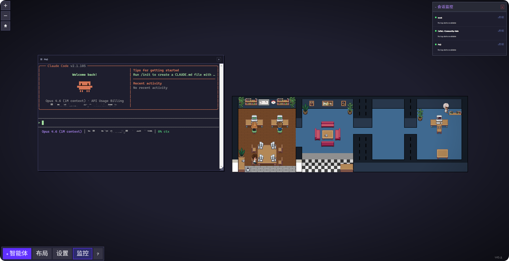

# Claude Code Office

[English](README_EN.md) | 中文

一个独立的 Electron 桌面应用，将你的 Claude Code 会话变成像素风动画办公室。每个会话化身为一个可观察、可交互、可管理的像素小人——所有操作集中在一个窗口完成。

基于 [Pixel Agents](https://github.com/pablodelucca/pixel-agents)（pablodelucca）二次开发。



## 功能特性

### 会话管理

Claude Code Office 是一个功能完整的 Claude Code 会话管理器。你可以新建会话、恢复历史会话、继续上次对话，一切操作都在像素办公室界面中完成。

底部工具栏的"+ 智能体"按钮打开一个下拉菜单，提供多种选项。"新建会话"在选定的工作目录中启动一个全新的 Claude Code 实例。"恢复某次会话"打开 Claude 的交互式会话选择器，让你跳转到任意一次历史对话。"继续上次对话"重连到选定目录中最近一次的会话。还有一个"跳过权限模式"开关，以 `--dangerously-skip-permissions` 模式启动会话。

应用关闭时，所有正在运行的会话会被优雅中断（Ctrl+C），元数据持久化到磁盘。下次启动时，每个智能体角色会在办公室中重现，保留原有的皮肤配色和座位分配。双击一个已保存的智能体，会通过 `claude --resume` 在原始工作目录中重新连接其会话。除非手动删除，智能体会始终保留在办公室中。

项目名称从工作目录路径自动提取——路径的最后一级文件夹名即为角色标签（例如 `F:/Projects/my-app` 显示为 "my-app"）。

### 交互式终端

双击任意角色打开一个像素风浮动终端对话框。对话框内封装了一个真实的 `node-pty` 进程运行 Claude Code，因此 CLI 的所有功能完整保留——工具审批提示、流式输出、MCP 集成、Hooks、Skills，一切照旧。

终端对话框支持拖拽移动（通过标题栏）、拖拽调整大小（右下角把手）、鼠标滚轮回滚查看历史对话。标题栏中的状态指示点显示会话当前状态：运行中（绿色）、等待输入（黄色）、空闲（灰色）。当底层会话退出时，对话框自动关闭。

### 像素办公室

办公室基于 Canvas 2D 引擎渲染，内置 BFS 寻路、Z 轴排序精灵和角色状态机。每个 Claude Code 会话拥有自己的动画角色，实时反映当前行为——编写代码时打字、搜索文件时阅读、空闲时四处闲逛。角色有多样化的配色方案（6 种基础皮肤 + 色相偏移变体），角色就座办公时电子设备（显示器、电脑）自动切换为开启状态。

办公室中的植物有微妙的呼吸动画——以花盆底部为锚点进行轻微的缩放摆动，花盆保持不动而叶片轻轻摇曳。每株植物有独立的相位偏移，避免同步晃动。

通过 Task 或 Agent 工具产生的子智能体会作为临时角色出现，与其父级关联。团队内联成员也会获得各自的角色。气泡提示会标示智能体何时需要权限审批或已完成其回合。

### 办公室布局编辑器

内置的布局编辑器让你自由定制办公室。点击"布局"按钮切换编辑模式，使用工具栏涂刷地板、放置墙壁、添加家具和擦除方块。编辑器支持撤销/重做（50 级）、家具旋转与状态切换、拖拽移动、地板和墙壁的 HSB 色彩调节，以及点击幽灵边框将网格扩展至最大 64×64 格。

布局保存在应用目录的 `data/layout.json` 中。你可以通过设置弹窗导出和导入 JSON 格式的布局文件。默认布局包含主办公区和一个独立的监控室。

### 监控室与会话监控

主办公室右侧有一间独立的监控室，以墙壁分隔并通过门洞连通。室内有一个特殊的监控 NPC——一个不绑定任何真实 Claude 会话的虚拟角色。监控 NPC 每 15-30 秒自动切换行为：在桌前工作、走到书架前阅读、或在房间内随意走动，让办公室充满生活气息。

监控室内的白板同时充当公告栏——点击它可以打开会话监控面板。监控面板也可以通过底部工具栏的"监控"按钮切换。面板显示每个活跃会话的摘要信息：项目名称、一句话描述当前正在做什么、最后活跃时间戳和状态指示点（绿色 < 30 秒、黄色 < 2 分钟、灰色为更早）。

摘要通过调用 Claude API（claude-3-5-haiku）从每个会话的 JSONL 日志中提取内容生成。API 的提示词包含当前 UI 语言，因此摘要会以用户选择的语言生成。认证通过 `ANTHROPIC_API_KEY` 环境变量或 `~/.claude/.credentials` 自动读取。

### 插件系统

插件通过自定义交互式家具来扩展办公室。每个插件位于 `plugins/` 目录下的一个子文件夹中（与可执行文件同级），包含 `manifest.json`、精灵图 PNG 和 HTML 面板文件。

当插件家具被放置在办公室中并被点击时，会打开一个新窗口显示插件面板 UI。面板运行在沙箱化的 BrowserWindow 中（`contextIsolation: true`，无 `nodeIntegration`），不能直接访问主进程或文件系统。插件面板路径经过目录穿越攻击校验。

项目自带一个示例插件 `plugins/example-todo/`，提供一个像素风便签贴纸，可放置在墙上，点击后打开一个支持 localStorage 持久化的待办事项列表。

插件 manifest 格式：

```json
{
  "id": "my-plugin",
  "name": "My Plugin",
  "version": "1.0.0",
  "furniture": {
    "id": "PLUGIN_MY_PLUGIN",
    "sprite": "sprite.png",
    "footprint": [[1, 2]],
    "category": "wall",
    "canPlaceOnWalls": true
  },
  "panel": "panel.html",
  "panelSize": { "width": 400, "height": 500 }
}
```

### 国际化（i18n）

整个 UI 支持三种语言：English、中文、日本語。可以在设置弹窗中随时切换语言，选择在重启后保持不变。所有 UI 文本——按钮、标签、工具提示、编辑器工具、帮助文本、错误对话框和更新日志弹窗——均已翻译。监控摘要也会通过 Claude API 以用户选择的语言生成。

i18n 系统基于 `react-i18next` + `i18next` 构建，支持命名空间拆分，便于后续新增语言或按模块分割翻译文件。

### 视角控制

办公室视图支持鼠标中键拖拽平移、Ctrl+滚轮缩放、Shift+滚轮水平平移。缩放控件中的复位按钮（房屋图标）将视图恢复到默认位置和缩放级别。摄像机会自动跟随选中的角色，手动平移可打断跟随。

### 帮助

底部工具栏的"?"按钮打开一个像素风帮助弹窗，包含功能概览和快捷键参考两部分。帮助内容支持完整的多语言翻译。

## 环境要求

- [Claude Code CLI](https://docs.anthropic.com/en/docs/claude-code) 已安装并在 PATH 中
- Node.js 18+
- Windows（主要目标平台；macOS/Linux 未测试）

## 快速开始

```bash
git clone https://github.com/Open-Shadow/claude_code_office.git
cd claude_code_office
npm install
cd renderer && npm install && cd ..
npm run build
npm start
```

或全局安装：

```bash
npm install -g .
claude-office
claude-office --dir F:/Projects/my-app
```

`--dir` 参数在启动时自动在指定目录创建一个会话。

## 数据存储

所有配置和运行时数据存储在可执行文件旁的 `data/` 目录中（开发模式下为项目根目录）：

- `data/layout.json` — 办公室布局（网格、家具、地砖颜色）
- `data/settings.json` — 用户偏好（声音、语言、Hooks 等）
- `data/agents.json` — 智能体座位分配和配色数据
- `data/persisted-agents.json` — 跨重启的会话元数据

Claude CLI 自身的文件（`~/.claude/`）仅读取不写入。

## 技术栈

- **主进程**：TypeScript, Electron, node-pty, pngjs
- **渲染进程**：React 19, TypeScript, Vite, Canvas 2D, Tailwind CSS v4, xterm.js
- **会话检测**：JSONL 文件监听 + Claude Code Hooks API
- **监控**：@anthropic-ai/sdk（claude-3-5-haiku）
- **国际化**：react-i18next + i18next

## 项目结构

```
claude_code_office/
├── electron/              # 主进程
│   ├── main.ts            # 应用入口，IPC 处理，资源/布局加载
│   ├── preload.ts         # 上下文桥接，IPC 通道白名单
│   ├── sessionManager.ts  # node-pty 会话生命周期
│   ├── monitorAgent.ts    # 日志读取 + Claude API 摘要
│   ├── pluginLoader.ts    # 插件发现与加载
│   └── assetLoader.ts     # PNG 精灵图解析
├── renderer/              # React 渲染进程
│   ├── src/
│   │   ├── office/        # Canvas 引擎，角色，渲染，布局
│   │   ├── terminal/      # xterm.js 终端对话框和管理器
│   │   ├── monitor/       # 会话监控面板
│   │   ├── i18n/          # 国际化（en, zh, ja）
│   │   ├── hooks/         # React Hooks（消息，编辑器）
│   │   └── components/    # UI 组件（工具栏，设置，帮助）
│   └── package.json
├── plugins/               # 内置插件
│   └── example-todo/      # 示例：像素风待办事项板
├── assets/                # 精灵图，家具目录，地板/墙壁图块
├── data/                  # 运行时数据（布局，设置，会话）
├── server/                # Hook 接收服务器（来自 pixel-agents）
├── shared/                # 共享类型和工具
└── bin/                   # CLI 入口（claude-office）
```

## 致谢

- 像素办公室引擎和角色精灵图：[Pixel Agents](https://github.com/pablodelucca/pixel-agents)，pablodelucca 作品（MIT）
- 角色精灵图基于 [Metro City](https://jik-a-4.itch.io/metrocity-free-topdown-character-pack)，JIK-A-4 作品

## 许可证

MIT
